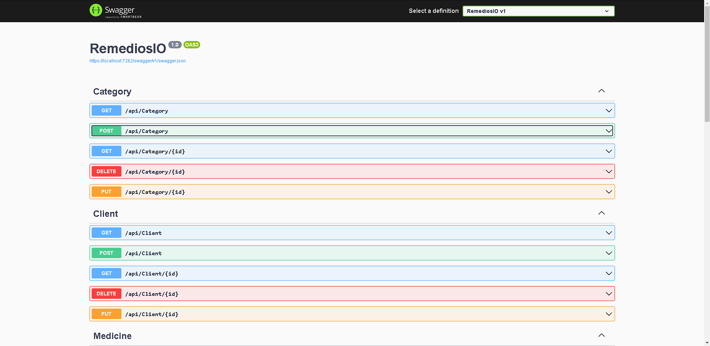
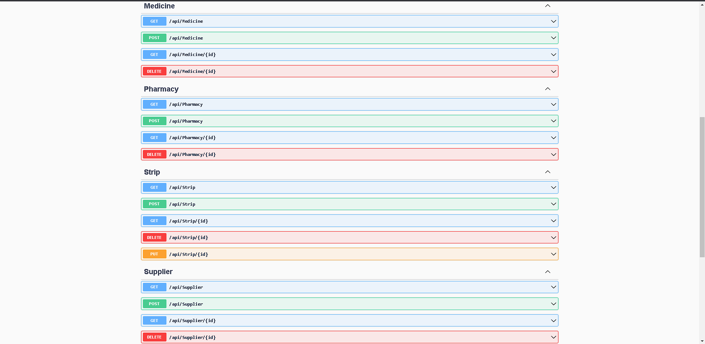
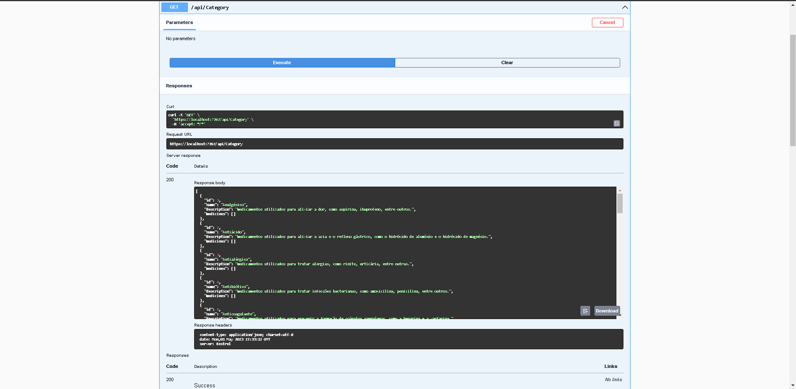
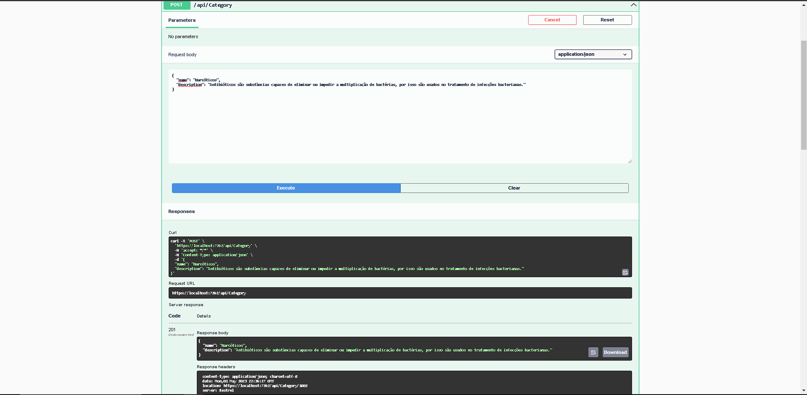
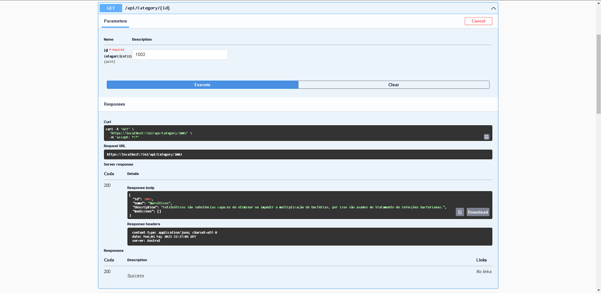
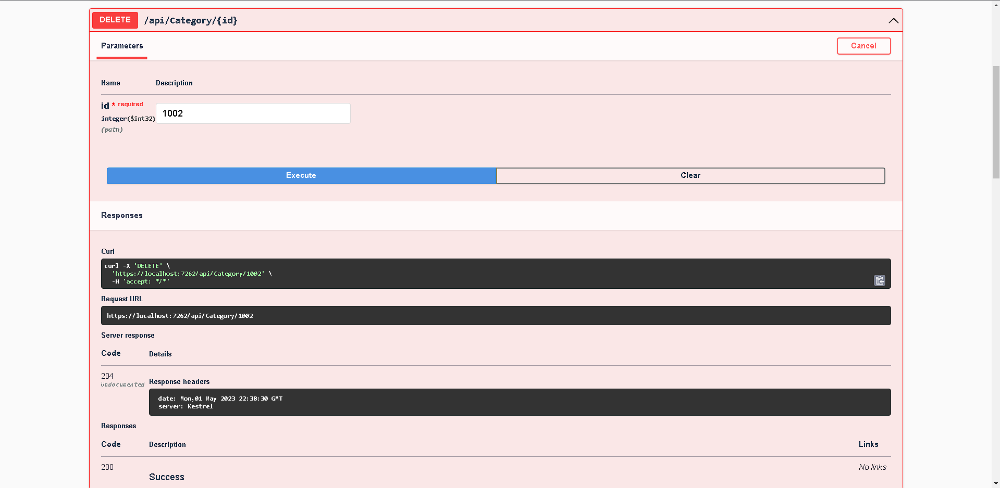

# <h1 align="center"> RemediosIO </h1>

## <p align="center"></p>

# Índice 

* [Prints da API documentada no Swagger](#-documentação-da-API)
* [Sobre o projeto](#-sobre-o-projeto)
* [Funcionalidades](#-funcionalidades)
* [Como executar](#-como-executar-o-projeto)
* [Tecnologias](https://github.com/Brunosoaresfreitas/DevFreela/blob/main/README.md#%EF%B8%8F-tecnologias)
* [Autores](https://github.com/Brunosoaresfreitas/DevFreela/blob/main/README.md#%EF%B8%8F-autores)
* [Acessar o Projeto](#-acesso-ao-projeto)

## Documentação da API 










## 💻 Sobre o projeto

Dev Freela -> Plataforma para cadastro e contratação de freelancers.

Projeto desenvolvido durante o curso Formação ASP .NET Core - ministrado pelo Luis Dev.

## 🎯 Funcionalidades


✔️ Login dos usuários

✔️ Cadastrar / atualizar/ excluir / consultar remédios, categorias, tarjas, fornecedores, farmácias e clientes


## 🚀 Como executar o projeto

### 📋 Pré-requisitos

Antes de executar o projeto, é necessário ter instalado em sua máquina local as seguintes ferramentas: [Git](https://git-scm.com/)

Algum editor para trabalhar com o código, como por exemplo o [Visual Studio](https://visualstudio.microsoft.com/pt-br/) com a carga de trabalho de desenvolvimento Web e do ASP.NET.


## 🎲 Executando a API - Passo a passo

```
# Clone este repositório
$ git clone https://github.com/Brunosoaresfreitas/RemediosIO.git

# Navegue pelo cmd até a pasta que contém o arquivo principal do projeto .\RemediosIO\RemediosIO

# Instale as dependências
$ dotnet restore

# Realize o build do projeto
$ dotnet build

# Execute a aplicação 
$ dotnet run

# O servidor inciará por padrão na porta porta:7262 - acesse http://localhost:7262
```

## 🛠️ Tecnologias

As seguintes tecnologias e métodos foram utilizadas durante o desenvolvimento do projeto

- ``C#``

- ``ASP.NET Core Web API``

- ``Entity Framework Core``

- ``SQL Server``

- ``Padrão Repository``

## ✒️ Autores
- Bruno Henrique

<a href="https://www.linkedin.com/in/bruno-henrique-soares-de-freitas-32ab85243/" target="_blank"></a>   

## 📁 Acesso ao projeto
Você pode acessar os arquivos do projeto clicando [aqui](https://github.com/Brunosoaresfreitas/RemediosIO/tree/main/RemediosIO).
